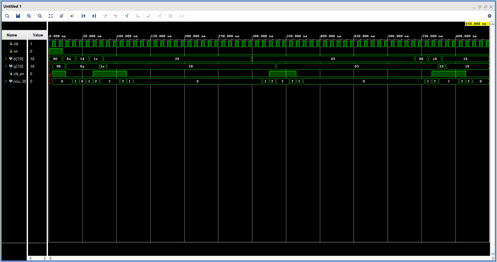

# Self-Adaptive Power-Aware RTL Architecture

> Runtime Toggle Prediction for Dynamic Power Reduction

## Overview
A low-power RTL architecture that monitors signal switching activity at runtime and adaptively disables the clock during low-activity periods — reducing the switching activity factor (α) in:

**P_dynamic = α × C × V² × f**

## Files
| File | Description |
|------|-------------|
| `adaptive_predictor.v` | Top-level RTL module |
| `tb_adaptive_predictor.v` | Testbench |

## How It Works
1. Compares current vs previous input to detect toggles
2. Maintains a saturating counter (0–3) tracking recent activity
3. `clk_en = 1` when counter ≥ 2 (high activity)
4. `clk_en = 0` when counter < 2 (low activity) — register freezes

## Simulation Signals
- `clk` — System clock
- `d` — Input data
- `q` — Register output
- `clk_en` — Adaptive clock enable
- `counter` — Activity prediction counter

- ## Simulation Results

### Clock Gating Waveform

### Key Metrics
| Parameter | Value |
|---|---|
| Simulation Duration | 650 ns |
| Clock Period | ~10 ns |
| Idle Detection Window | 4 cycles (saturating counter) |
| clk_en Gating | Deasserts during low-activity idle periods |

**Observation:** `clk_en` signal deasserts during low-activity idle periods,
reducing dynamic switching. Counter-based predictor correctly identifies
idle windows and suppresses unnecessary clock edges.

## Tools
- Simulation: Vivado / ModelSim / Icarus Verilog
- Target: FPGA / ASIC
